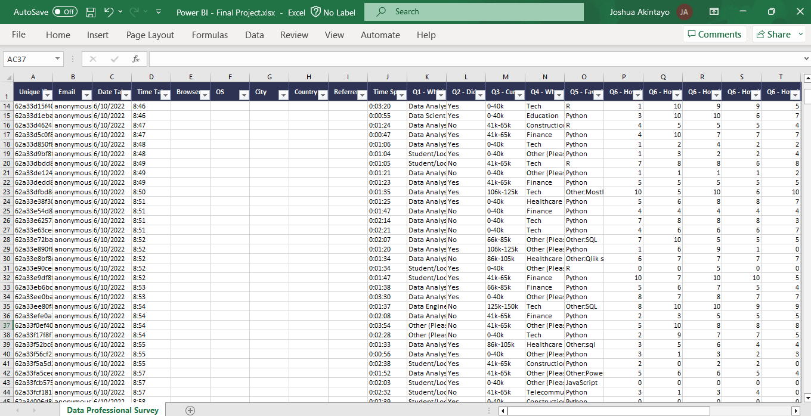
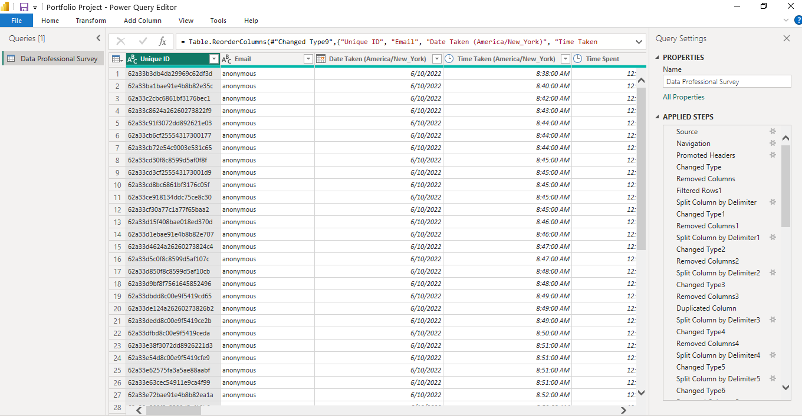
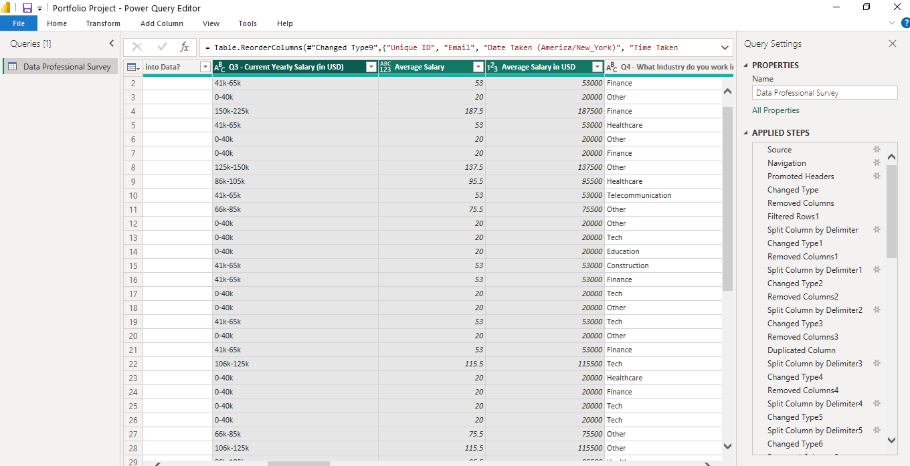
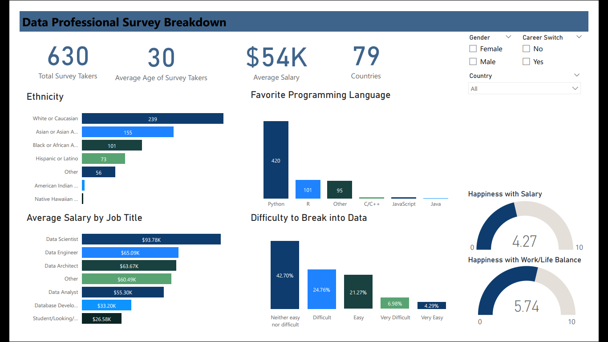
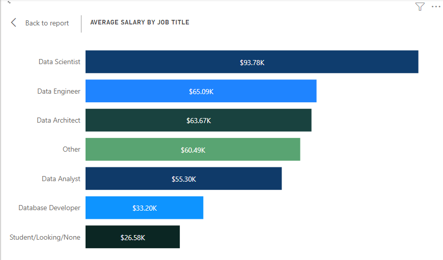
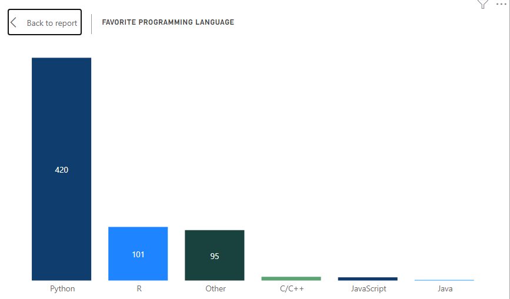
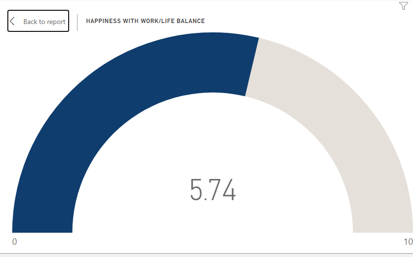
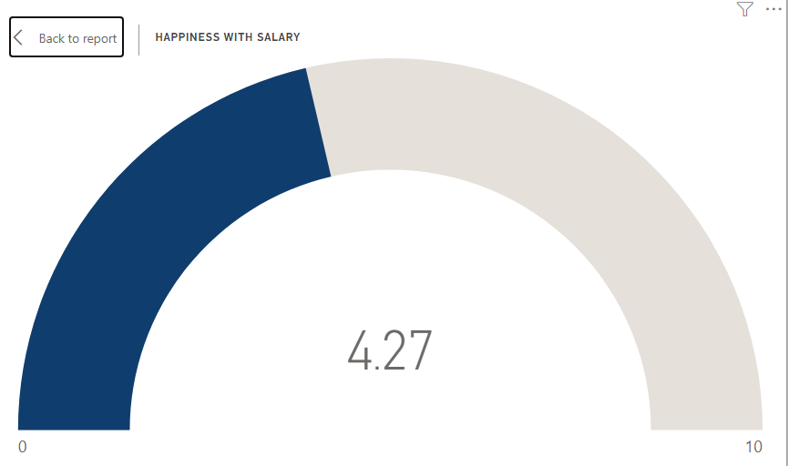

# Data-Professional-Survey

## Introduction

The aim of this project is to display my skills in analyzing and visualizing a survey carried out on Data professionals using PowerBI.

# Data Sourcing

This data was found online, downloaded as an excel file and then imported into PowerBI for cleaning, analysis and visualization. 

The dataset consists of 630 rows and 28 columns.

## Data Transformation

Data was efficiently cleaned and transformed with the Power Query Editor of Power BI.

#### Some of the applied steps included

1.	Adding a custom column to find the average salary which was carried out by spiting the ‘Current Yearly Salary (in USD)’ column and adding them together then divide by two.
2.	The ‘country’ column was added by splitting the ‘Which Country do you live in?’ column to get the individual countries of each survey taker and incorrect spellings of country names were replaced with the correct ones.
3.	 The above step  was also carried out to get the distinct Job title, Favorite programming language and Ethnicity columns.
   

## Data Modelling

No modelling was required since we need just a table for the analysis.

## Analysis and Visualization

1.	From 	the dashboard it is observed that the average salary is $54k.
2.	The survey takers were from 79 different countries.
3.	The average age was 30 years old.

It is observed that Data scientists earn the most money with an average salary of $96k

Phyton is the most used programming language by Data professionals.

                       |                   
:--------------------------------------:  | :-----------------------------------------:

Based on the dataset we were able to find out that on a scale of 1-10, the average benchmark for the work/life balance of data professional is 6. While that for salary is as low as 4.

## Conclusion and Recommendation

- About 43% found the transitioning to Data roles neither difficult nor easy.
- The ethnicity of the survey takers were majorly White or Caucasian.

### Recommendation: As this data survey was filled by few people more surveys need to be carried out to get more insights.

